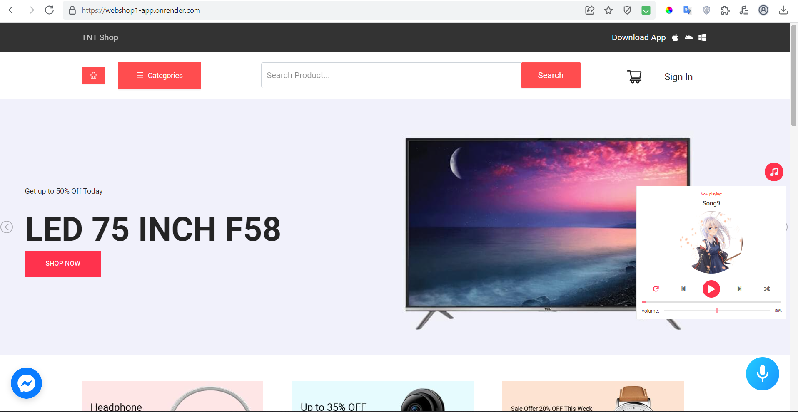
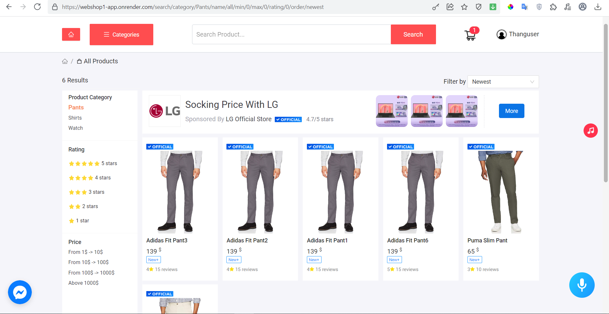
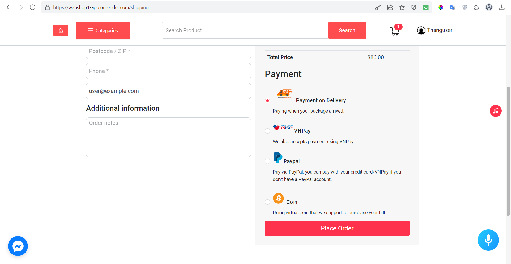

# GRADUATION PROJECT IN HCMUTE 2023 - Faculty For High Quality Training

**Topic**: Ecommerce website

**Technologies used**:

- BE: Mongoose API, NodeJS, MongoDB
- FE: ReactJS, Redux, Ant Design

**Team members**: 3
- Bùi Thanh Ngọc - 18110034
- Lê Minh Thắng - 18110048
- Châu Kim Tỏa - 18110056

## Description

- This is the website for customer to buy products online and seller to sell their goods with some interesting features (listen to music when shopping like real store, buy product with voice or purchase product with virtual coin, map box, …).

- Link to our website: https://webshop1-app.onrender.com (I’m still keep it but because I'm only used free hosting so it will hibernate after a long time no one use the app and take time to load again in next time, please forgive us about that).
- Demo account (to our website link above):<br />
Admin: admin@example.com - pwd: 123456<br />
Client: user@example.com - pwd: 123456<br />
Seller: seller@example.com - pwd: 123456<br />

  
  
  

## SETUP

- Clone project

```
git clone https://github.com/ThangLe2209/kltn.git
```

# BE

- Move to project backend

```
cd backend
```

- Download library

```
npm i
```

- Create .env file and add all variables

```
# Your mongodb_url and backend port (default port 5000 if not use) 
MONGODB_URL=YOUR_MONGODB_URL
PORT=YOUR_BACKEND_PORT

# Your token for verify email (register account and forget pass) 
ACTIVATION_TOKEN_SECRET=YOUR_ACTIVATION_TOKEN_SECRET

# Your token for authentication
ACCESS_TOKEN_SECRET=YOUR_ACCESS_TOKEN_SECRET
REFRESH_TOKEN_SECRET=YOUR_REFRESH_TOKEN_SECRET

# Paypal cliend id receive money
PAYPAL_CLIENT_ID=YOUR_PAYPAL_CLIENT_ID

# Your website domain name (http://localhost:3000 for development)
CLIENT_URL=YOUR_CLIENT_URL

# Mailing service (thank you letter for customer buy, register account and forget pass email)
MAILING_SERVICE_CLIENT_ID=YOUR_MAILING_SERVICE_CLIENT_ID
MAILING_SERVICE_CLIENT_SECRET=YOUR_MAILING_SERVICE_CLIENT_SECRET
MAILING_SERVICE_REFRESH_TOKEN=YOUR_MAILING_SERVICE_REFRESH_TOKEN
SENDER_EMAIL_ADDRESS=YOUR_SENDER_EMAIL_ADDRESS

# Google login
GOOGLE_SECRET=YOUR_GOOGLE_SECRET

```

- Run project backend

```
npm start or nodemon server.js
```

# Socket server
- Move to project socket

```
cd socket
```

- Download library

```
npm i
```

- Run project

```
npm start or nodemon index.js
```
# FE

- Move to project frontend

```
cd frontend
```

- Download library

```
npm i
```

- Run project

```
npm start
```
